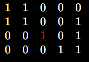

The **“Number of Islands”** problem is one of the most important beginner graph problems.

It teaches:

* Graph traversal
* Connected components
* DFS/BFS
* Matrix traversal
* Visited tracking

It is basically the **matrix version of connected components in graphs**.

---

# 1. What Is the Problem?

You are given a 2D grid (matrix) containing:

* `'1'` → land
* `'0'` → water

Your task is:

> Count how many separate islands exist.

---

# 2. What Is an Island?

An island is:

* A group of connected `'1'` cells
* Connected **horizontally or vertically**
* Surrounded by water (`0`)

Usually diagonal connection is **NOT allowed** unless specifically mentioned.

---

# 3. Example

## Matrix


Let us visualize it.

---

# 4. Visual Representation

## Island 1


These four cells are connected.

So this is **ONE island**.

---

## Island 2


These are connected vertically.

So this is **SECOND island**.

---

## Island 3




This single isolated `1` is another island.

So total:

# Answer = 3 islands

---

# 5. Why Is This a Graph Problem?

Because every cell behaves like a node.

Each land cell (`1`) connects to neighboring land cells.

So the matrix becomes a graph.

---

# 6. Matrix → Graph Conversion Thinking

Suppose we are at:

\[
grid[1][1]
\]

Possible moves:

* Up
* Down
* Left
* Right

So each cell can connect to at most 4 neighbors.

That is exactly a graph.

---

# 7. Core Idea of the Problem

The problem is actually asking:

# “How many connected components exist?”

---

## Meaning of Connected Component

A connected component is:

> A group where every node can reach every other node.

In islands:

* Connected land cells = one component
* Separate land groups = different components

So:

# Number of Islands = Number of Connected Components

---

# 8. Main Observation

Whenever you find a new unvisited land cell (`1`):

* You discovered a NEW island
* Increase count
* Traverse the entire connected land area

---

# 9. How Traversal Works

Suppose:


Start scanning from top-left.

---

## Step 1

Find first `1`

\[
(0,0)
\]

Island count becomes:

# islands = 1

Now explore all connected land from there.

Visited:


---

## Step 2

Continue scanning.

Next unvisited `1`:

\[
(1,2)
\]

New island found.

# islands = 2

Explore connected cells:


Done.

Answer = 2

---

# 10. Two Important Concepts

---

## A) Visited Array

We must avoid revisiting cells.

Otherwise:

* infinite loops
* repeated counting

So we maintain:

\[
visited[row][col]
\]

---

## B) Traversal

We use:

* DFS (Depth First Search)
  OR
* BFS (Breadth First Search)

Both work perfectly.

---

# 11. DFS Intuition

DFS means:

> Keep going deeper before coming back.

From one land cell:

* visit neighbors
* then neighbors of neighbors
* continue until whole island explored

---

# 12. BFS Intuition

BFS means:

> Explore level by level.

Using queue:

* current cell
* all neighbors
* then next layer

---

# 13. Typical Directions Array

Very important in matrix problems.

For 4-direction movement:

```cpp
int dr[] = {-1, 1, 0, 0};
int dc[] = {0, 0, -1, 1};
```

Meaning:

| Direction | Row Change | Col Change |
| --------- | ---------- | ---------- |
| Up        | -1         | 0          |
| Down      | +1         | 0          |
| Left      | 0          | -1         |
| Right     | 0          | +1         |

---

# 14. General Algorithm

---

## Step 1

Traverse every cell.

---

## Step 2

If cell is:

* land (`1`)
* not visited

then:

* island++
* run DFS/BFS from that cell

---

## Step 3

DFS/BFS marks entire island visited.

---

## Step 4

Continue scanning matrix.

---

# 15. Time Complexity

Suppose:

* rows = (n)
* cols = (m)

Each cell visited once.

So:

\[
O(n \times m)
\]

---

# 16. Space Complexity

Visited array:

\[
O(n \times m)
\]

DFS recursion stack can also go up to:

\[
O(n \times m)
\]

in worst case.

---

# 17. Why This Problem Is SUPER Important

This problem teaches the foundation for:

* Graph traversal
* Flood fill
* Connected components
* Multi-source BFS
* Grid problems
* Shortest path in matrix
* Rotten oranges
* Surrounded regions
* Word search
* Pacific Atlantic water flow

This is one of the core graph patterns.

---

# 18. One-Line Intuition

# “Whenever you find an unvisited land cell, you discovered a new connected component (island). Traverse the whole component and count it once.”

---

# 19. Real Life Analogy

Imagine satellite view of Earth:

* Land = `1`
* Ocean = `0`

Separate land masses are islands.

Your job:

> Count separate land groups.

---

# 20. What Makes This Problem Tricky?

Beginners usually struggle with:

* Thinking matrix as graph
* Understanding connected components
* Marking visited properly
* Boundary checking
* Traversal directions

Once these become clear, most matrix graph problems become easier.


---
---
---
---
---
---
---

---


Okay — forget code completely for now.

Let’s ONLY build the intuition visually.

---

# Think of the Matrix as a Map

Suppose:


Where:

* `1` = land
* `0` = water

Imagine this as real islands in ocean.

---

# Visual Form

```text id="sbh5e7"
L L W W
L W W L
W W L L
W W W W
```

Where:

* L = land
* W = water

---

# Goal

We need to count:

# How many separate land groups exist?

---

# IMPORTANT THING

Two lands belong to SAME island only if they touch:

* up
* down
* left
* right

NOT diagonally.

---

# STEP-BY-STEP THINKING

We start scanning the matrix from top-left.

Like reading a book.

---

# Step 1

We arrive at:

```text id="v9kj0i"
(0,0)
```

Value = `1`

That means:

# We discovered land.

And since nobody visited it before:

# We found a NEW island.

So:

```text id="j6e5df"
islands = 1
```

---

# Now the Most Important Part

Once we find ONE land cell of an island:

# We should explore the ENTIRE island immediately.

Why?

Because otherwise we may count same island again later.

---

# So What Do We Do?

From `(0,0)` we spread in all 4 directions.

---

## From `(0,0)`

We can go:

* right → `(0,1)` = land
* down → `(1,0)` = land

So they belong to SAME island.

---

# Visualize Exploration

Starting:

```text id="6e2qae"
L L W W
L W W L
W W L L
W W W W
```

After exploring first island:

```text id="a9avd2"
X X W W
X W W L
W W L L
W W W W
```

`X` means visited.

---

# HUGE UNDERSTANDING

Notice something:

We counted this ENTIRE connected region as:

# ONE island only.

---

# Continue Scanning

Now continue moving through matrix.

---

# Eventually We Reach

```text id="4bim8u"
(1,3)
```

Value = `1`

Not visited.

That means:

# This is another NEW island.

So:

```text id="h4nqec"
islands = 2
```

---

# Again Explore Entire Connected Land

From `(1,3)`:

* down → `(2,3)` = land
* left from `(2,3)` → `(2,2)` = land

All connected.

---

# Final Visited Map

```text id="eg6a9q"
X X W W
X W W X
W W X X
W W W W
```

Done.

---

# Final Answer

# 2 islands

---

# CORE IDEA OF THE WHOLE PROBLEM

The problem is NOT:

# “Count all 1s”

The problem IS:

# “Count separate connected groups of 1s”

---

# THE REAL APPROACH

The REAL approach is:

---

## Scan Every Cell

When you find:

* land (`1`)
* unvisited

then:

# “Aha! New island found.”

Increase count.

---

## Then Flood Entire Island

Visit all connected lands immediately.

Mark them visited.

So they never get counted again.

---

# Why DFS/BFS Is Used

DFS/BFS are just tools for:

# “Flooding the whole island”

That’s all.

---

# Real Life Analogy

Imagine satellite scanning Earth.

Whenever satellite finds unexplored land:

* mark island count++
* send drone to map entire connected land
* mark all explored
* continue scanning Earth

---

# THIS IS THE ENTIRE PROBLEM

Everything else:

* DFS
* BFS
* recursion
* queue

are just implementation details.

---

# MOST IMPORTANT MENTAL MODEL

# “Find one land cell → consume entire connected land mass → count once.”

That is the complete intuition.


---
---
---
---
---
---
---
---
---
---


Alright.
Now let’s deeply understand the code step-by-step.

This is the MOST important phase.

---

# FULL CODE

```cpp id="3khh4v"
class Solution {
public:

    void dfs(int node, vector<int> adj[], vector<int>& vis) {

        vis[node] = 1;

        for(auto neighbour : adj[node]) {

            if(!vis[neighbour]) {
                dfs(neighbour, adj, vis);
            }
        }
    }

    int numberOfComponents(int V, vector<vector<int>>& edges) {

        vector<int> adj[V];

        for(auto edge : edges) {

            int u = edge[0];
            int v = edge[1];

            adj[u].push_back(v);
            adj[v].push_back(u);
        }

        vector<int> vis(V, 0);

        int count = 0;

        for(int i = 0; i < V; i++) {

            if(!vis[i]) {

                count++;

                dfs(i, adj, vis);
            }
        }

        return count;
    }
};
```

---

# 1. What Are We Solving?

We need:

# Number of Connected Components

---

Example:

```text id="wsv2m4"
0 -- 1 -- 2

3
```

There are:

* one connected group `{0,1,2}`
* one separate node `{3}`

So answer = 2

---

# 2. Understanding the Function

---

## This Function

```cpp id="r8y2ol"
int numberOfComponents(int V, vector<vector<int>>& edges)
```

receives:

---

## A) V

Number of vertices.

Example:

```text id="f4d4yu"
V = 4
```

means nodes are:

```text id="y4ub82"
0 1 2 3
```

---

## B) edges

Connections between nodes.

Example:

```cpp id="rgr8rm"
edges = {{0,1}, {1,2}}
```

means:

```text id="v8bjlwm"
0 -- 1 -- 2
```

---

# 3. Adjacency List Creation

---

## This Part

```cpp id="dklvzk"
vector<int> adj[V];
```

creates adjacency list.

---

# What Is Adjacency List?

It stores:

# “Who is connected to whom”

---

# Example

Suppose:

```cpp id="e1ms2m"
edges = {{0,1}, {1,2}}
```

Then adjacency list becomes:

```text id="0v4f4m"
0 -> 1
1 -> 0,2
2 -> 1
3 -> empty
```

---

# How This Happens

---

## Loop

```cpp id="0qz28r"
for(auto edge : edges)
```

takes each edge one-by-one.

---

# First Iteration

```cpp id="z3rwv0"
edge = {0,1}
```

---

## These Lines

```cpp id="dk6w2q"
int u = edge[0];
int v = edge[1];
```

So:

```text id="ls28kp"
u = 0
v = 1
```

---

## Then

```cpp id="3lbgki"
adj[u].push_back(v);
```

means:

```text id="gtg0mf"
0 connected to 1
```

---

## And

```cpp id="d6xwbz"
adj[v].push_back(u);
```

means:

```text id="fck6r5"
1 connected to 0
```

Because graph is UNDIRECTED.

---

# Final Adjacency List

```text id="1j7jph"
adj[0] = {1}
adj[1] = {0,2}
adj[2] = {1}
adj[3] = {}
```

---

# 4. Visited Array

---

## This

```cpp id="4rjlwm"
vector<int> vis(V, 0);
```

creates:

```text id="8hz4kq"
[0,0,0,0]
```

Meaning:

```text id="rn0q0r"
No node visited yet
```

---

# Why Needed?

Otherwise:

* infinite DFS
* repeated traversal
* repeated counting

---

# 5. Component Count

---

## This

```cpp id="4wukfc"
int count = 0;
```

stores answer.

---

# 6. Main Traversal Loop

---

## THIS is the outer loop

```cpp id="3h0v3w"
for(int i = 0; i < V; i++)
```

This scans ALL vertices.

---

# Iteration-by-Iteration

---

# i = 0

Check:

```cpp id="8lz3q1"
if(!vis[i])
```

means:

```cpp id="5qoc1j"
if(vis[0] == 0)
```

TRUE.

So node 0 is unvisited.

---

# IMPORTANT UNDERSTANDING

If a node is unvisited:

# We found a NEW component.

---

# Therefore

```cpp id="06h6xv"
count++;
```

Now:

```text id="0rt04g"
count = 1
```

---

# Then

```cpp id="st1vfh"
dfs(0, adj, vis);
```

This explores ENTIRE component.

---

# 7. DFS Function Understanding

---

# Function Header

```cpp id="4bgjlwm"
void dfs(int node, vector<int> adj[], vector<int>& vis)
```

Current node comes here.

Initially:

```text id="k9uc7r"
node = 0
```

---

# First Step

```cpp id="4r5w5l"
vis[node] = 1;
```

So:

```text id="3z6wqv"
vis[0] = 1
```

Visited array:

```text id="i9r6vn"
[1,0,0,0]
```

---

# Then

```cpp id="zq1s3m"
for(auto neighbour : adj[node])
```

means:

# “Visit all neighbors of current node”

---

# Current Node = 0

Adjacency list:

```text id="p71f0r"
adj[0] = {1}
```

So loop runs for:

```text id="u1v07r"
neighbour = 1
```

---

# Check

```cpp id="y4jl08"
if(!vis[neighbour])
```

means:

```cpp id="q3ovsm"
if(vis[1] == 0)
```

TRUE.

So:

```cpp id="i3i93m"
dfs(1, adj, vis);
```

---

# DFS Goes Deeper

Now current node becomes:

```text id="p5odsl"
1
```

---

# Mark Visited

```text id="p0l0lt"
vis[1] = 1
```

Now:

```text id="n3j7bk"
[1,1,0,0]
```

---

# Explore Neighbors of 1

```text id="h5l8zc"
adj[1] = {0,2}
```

---

## Neighbor = 0

Already visited.

Skip.

---

## Neighbor = 2

Unvisited.

Call:

```cpp id="yuwax2"
dfs(2, adj, vis);
```

---

# Node 2

Mark visited:

```text id="p3w1vv"
[1,1,1,0]
```

Neighbors:

```text id="1wo2ci"
adj[2] = {1}
```

1 already visited.

DFS ends.

---

# DFS COMPLETELY FINISHED

Meaning:

# Entire component visited.

---

# Back to Outer Loop

---

## i = 1

Already visited.

Skip.

---

## i = 2

Already visited.

Skip.

---

## i = 3

Unvisited.

So:

```text id="1xk9nn"
count = 2
```

Call DFS for node 3.

---

# Node 3

No neighbors.

DFS ends immediately.

---

# Final Answer

```cpp id="l8x8qz"
return count;
```

returns:

```text id="68ux94"
2
```

---

# MOST IMPORTANT CONCEPT

The OUTER LOOP:

# Finds new components

---

The DFS:

# Completely consumes one component

---

# THIS Pattern Appears Everywhere

* Number of Islands
* Provinces
* Connected Components
* Flood Fill
* Surrounded Regions
* Rotting Oranges
* Graph traversal problems

This is one of the most fundamental graph patterns.
