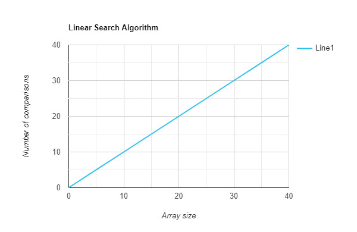

### ✅ What is Time Complexity?

**Time Complexity** is a **mathematical concept** used in **algorithm analysis**.
It tells you **how the runtime of an algorithm grows** as the **size of the input (n)** increases.

---

### 🔧 Think of it like this:

* It **does not measure actual time (in seconds)**.
* It measures **how the number of operations increases** relative to input size.
* It assumes a **standard model of computation** (like one operation takes 1 step).

---

### 🧠 Why Time ≠ Time Complexity?

| Scenario             | Explanation                                                               |
| -------------------- | ------------------------------------------------------------------------- |
| **Old PC vs New PC** | A faster CPU executes more instructions per second, so real time differs. |
| **Time Complexity**  | Ignores hardware; it only looks at how input size affects steps required. |

For example:

```cpp
for (int i = 0; i < n; i++) {
    cout << i;
}
```

* This runs in **O(n)** time complexity.
* But:

  * It may take **1 second** on a new PC.
  * And **5 seconds** on an old PC.
* Still, it's **O(n)** because steps grow linearly with `n`.

---

### 🧮 Common Time Complexities

| Time Complexity | Meaning       | Example                          |
| --------------- | ------------- | -------------------------------- |
| O(1)            | Constant time   | Accessing array element          |
| O(log n)        | Logarithmic     | Binary search                    |
| O(n)            | Linear        | Simple loop                      |
| O(n log n)      | Linearithmic   | Merge sort, quicksort (avg case) |
| O(n²)           | Quadratic      | Nested loops                     |
| O(2ⁿ)           | Exponential    | Recursive Fibonacci              |

---

### 📌 Summary:

* **Time Complexity** = Theoretical step-count behavior as input size grows.
* **Execution Time** = Real-world measurement (affected by CPU, memory, etc).
* Time complexity gives a **machine-independent** way to compare algorithms.

---

### **What is Big O Notation?**
Big O notation is like a **shortcut** or a **label** to describe how an algorithm behaves when the input size gets really, really big. Instead of counting every second, it tells us the general trend.

For example:
- **O(1)**: "I can grab a toy from the box in one move, no matter how many toys are inside."
- **O(n)**: "I need to check each toy one by one."
- **O(n²)**: "I need to compare every toy with every other toy."

---

### **Example: Finding the Biggest Toy in a Box**
Let’s say you have a box of toys, and you want to find the biggest toy.

#### **Approach 1: Look at Each Toy**
1. You pick up each toy one by one and compare its size to the biggest toy you've seen so far.
2. After looking at all the toys, you know the biggest one.

- If there are **n toys**, you have to look at **n toys**.
- This takes **O(n)** time because you’re looking at each toy once.

---

#### **Approach 2: Assume the First Toy is the Biggest**
1. You pick the first toy and say, "This is the biggest."
2. Then, you compare every other toy to this one to see if it's bigger.

- You still need to compare all **n toys**.
- This also takes **O(n)** time.

---

### **What About Sorting Toys?**
If you need to arrange your toys from smallest to biggest:
1. You pick one toy and compare it with every other toy to find the smallest.
2. You repeat this for every toy.

- For **n toys**, you compare each toy with every other toy.
- This takes **O(n²)** time because you’re doing **n comparisons for each toy**.

---

### **Simple Analogy: Racing Cars**
Think of algorithms as cars in a race:
- **O(1)**: The car finishes in the same time, no matter how long the track is.
- **O(n)**: The car takes more time if the track is longer.
- **O(n²)**: The car has to drive the same track over and over for each lap.

---

### **Why Big O is Important**
Big O helps us pick the best way to solve a problem. For example:
- If you want to find a toy quickly, you’ll choose a method with **O(1)** or **O(n)** instead of **O(n²)**.
- It ensures your program runs fast even with a lot of input (like millions of toys!).

---

### **Visualizing Big O**
Here’s how different Big O notations behave as the input size increases:

| Input Size (n) | O(1) | O(n) | O(n²) |
|----------------|-------|-------|-------|
| 1              | 1     | 1     | 1     |
| 10             | 1     | 10    | 100   |
| 100            | 1     | 100   | 10,000|

---

### Summary:
- **Time Complexity**: Measures how long it takes to finish a task.
- **Big O**: A label that describes the "speed" of an algorithm as the input grows.
- **Key Idea**: Choose algorithms with smaller Big O for faster programs!


---
---
---


## 🧮 Common Time Complexities (With Real-Life Intuition)

---

### ✅ **O(1): Constant Time**

* **What it means**: The number of steps stays the same, no matter how large the input is.
* **Example**: You look up a word in a dictionary by directly opening the right page (like a direct index).
* **Growth**: Does **not grow** with input size.
* **Visual**: Flat line.

---

### ✅ **O(log n): Logarithmic Time**

* **What it means**: Each step **reduces the input** to a **fraction** of its size (typically half).
* **Example**: You find a name in a phonebook by **splitting** the book in half each time (binary search).
* **Growth**: Very slow, even for large inputs.
* **Visual**: Grows quickly at first, then flattens.

---

### ✅ **O(n): Linear Time**

* **What it means**: The number of steps increases **proportionally** with input size.
* **Example**: You scan every item in a list to find a match.
* **Growth**: If input doubles, time doubles.
* **Visual**: Straight, rising line.

---

### ✅ **O(n log n): Linearithmic Time**

* **What it means**: The algorithm does some **logarithmic work** at **each level** of the input.
* **Example**: Sorting big lists efficiently (like merge sort). You divide into halves (log n), but still process everything (n).
* **Growth**: Slightly faster than quadratic; very efficient for large data.
* **Visual**: Grows more than a line, but much less than a curve.

---

### ✅ **O(n²): Quadratic Time**

* **What it means**: You’re doing work **for every pair** of elements.
* **Example**: Comparing every student with every other student in a class.
* **Growth**: Time **quadruples** if input doubles.
* **Visual**: Parabola-like curve.

---

### ✅ **O(2ⁿ): Exponential Time**

* **What it means**: The work **doubles with each new input**.
* **Example**: Trying every possible combination (like brute-force password cracking).
* **Growth**: Becomes **impossible** very quickly — exponential explosion.
* **Visual**: Very steep curve — grows faster than anything else.

---

## 🧠 How to Calculate Time Complexity (Conceptual Method)

---

### 🔸 1. **Look for Repetition**

* Ask: *How many times does something happen as the input grows?*
* Loops → repeated operations → growth.

---

### 🔸 2. **Are Things Nested?**

* Inner operations within outer ones = **multiply**.
* If one process goes `n` times and inside it another goes `n` times → total is `n × n = n²`.

---

### 🔸 3. **Are Inputs Divided or Halved?**

* If each step **cuts the input** into parts, it’s **logarithmic**.
* If you **cut and also process everything**, it’s **n log n**.

---

### 🔸 4. **Does the Algorithm Branch or Recurse?**

* Recursive steps that branch out (like `do this twice for smaller parts`) often lead to **exponential growth**.

---

### 🔸 5. **Ignore Constants**

* If something takes `3n` steps, it's still just **O(n)** — constants don’t affect the shape of growth.
* We’re looking at **patterns of growth**, not exact counts.

---

### 🔸 6. **Keep Only the Highest Growth**

* If something takes `n² + n + 1` steps, just say **O(n²)** — it grows faster than the rest as `n` increases.
